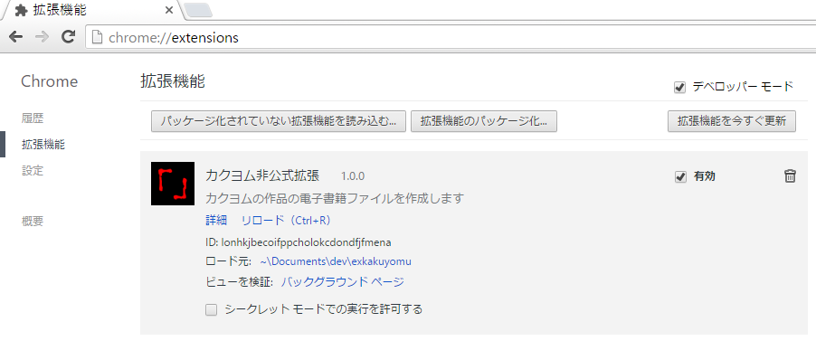
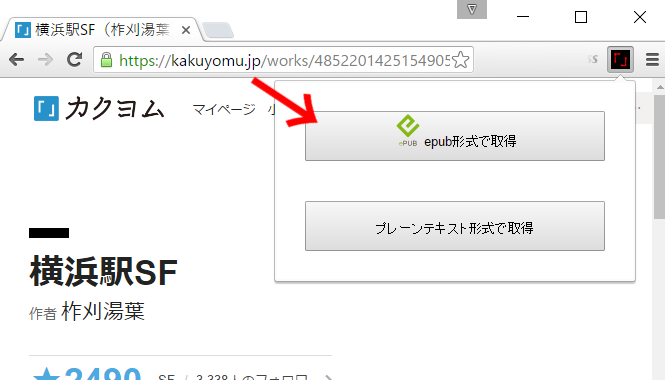
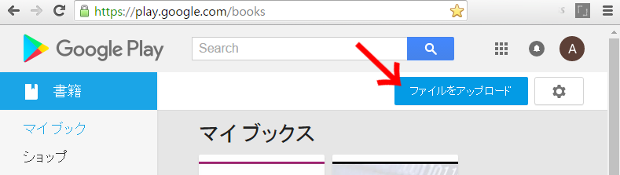
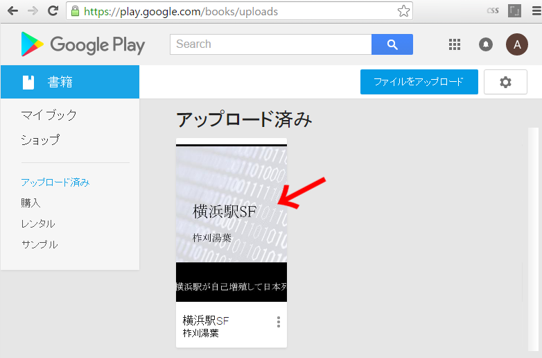
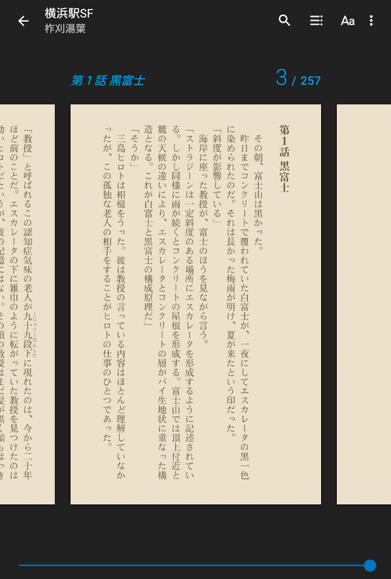

# exkakuyomu: カクヨム非公式拡張 for Google Chrome (ダウンロード/バックアップ/epub変換)

## 概要

　カクヨムの作品を電子書籍形式(epub形式)に変換するGoogle Chrome拡張です。
変換した電子書籍ファイルは、epubビューアを使えば、縦書き表示、ページ送り操作で閲覧できるようになります。また、エピソードの途中で読むのを中断しても、次回はそこから読書を再開できるので、ひとつのエピソードが長い作品でも読みやすくなります。

　この拡張でepub形式へと変換して読む方法は、完結済みの長編作品を一気読みしたいときに適しています。短編作品では横書きやスクロールで読んでも疲労はそれほどでもないですし、連載中の作品では更新があるごとに電子書籍ファイルを再生成する手間がかかるため、不向きです。

　また、作品データのバックアップ用途にも使えます。現状のカクヨムでは、ブラウザから各エピソードごとに手動でコピーアンドペーストする以外にデータをバックアップする方法はありませんが、この拡張を利用すればボタン一発で作品全体のプレーンテキスト形式のデータを取得することができます。

## 使い方

### 拡張機能のインストール(使う前に一度だけ実行します)

1. https://github.com/Inarinokami/exkakuyomu/releases/download/v0.9.0/exkakuyomu.crx をクリックして、拡張機能のパッケージ`exkakuyomu.crx`をダウンロードします。
2. 拡張機能のメニュー[chrome://extensions/](chrome://extensions/)を開き、ここに`exkakuyomu.crx`をドラッグアンドドロップします。
3. インストールの確認ダイアログが出るので承認すると、拡張機能の一覧に『カクヨム非公式拡張』が追加されます。

### 電子書籍形式(epub形式)への作品の変換(読みたい作品それぞれについて、以下の手順を繰り返します)

5. カクヨムの各作品ページに行くと、ブラウザ右上の拡張機能のアイコンがアクティブになります。そのアイコンをクリックします。
6. 拡張機能のポップアップメニューから、『epub形式で取得』ボタンをクリックすると、作品のダウンロードと変換が開始されます。
7. epub変換が完了すると、ブラウザのダウンロードフォルダに「
作者名『作品名』.epub」という電子書籍ファイルが自動的にダウンロードされます。

### 電子書籍ファイルの閲覧をする方法の一例(Google Playブックスへの追加)

8. Google Play Booksの『マイブックス』( https://play.google.com/books )に行き、右上の『ファイルをアップロード』ボタンを押します。
9. ファイルの選択ダイアログが出るので、ここに『作品名.epub』というファイルをドラッグアンドドロップします。アップロードが完了すると、一覧に書籍が追加されます(PC版ブラウザ上のビューアでは正常に表示できないようです。調査中)。
10. 携帯端末側でPlayブックスアプリケーションを起動し、右上のメニューから『更新』を選択します。パソコンのブラウザ側でアップロードした電子書籍ファイルが表示されるはずです。

### 拡張機能のアンインストール

11. 拡張機能の一覧から、右上のゴミバケツのアイコンをクリックします。
12. 確認ダイアログが出るので削除を了承します。

## バックアップツールとしての使用

1. 各作品のページに行き、アイコンがアクティブになったらクリックします。ポップアップダイアログが表示されます。
2. 『プレーンテキスト形式で取得』ボタンをクリックします。ダウンロードが完了すると、「作者名『作品名』」という圧縮ファイルがブラウザによってダウンロードされます。

## 注意事項

* サーバへの高頻度なアクセスを避けるために、ダウンロードの速度は遅めにしてあります。気長にお待ちください
* ログイン状態のブラウザで使用した場合、ダウンロードしようとするすべてのエピソードに自分の閲覧履歴が残ります。
* 最後に読んだエピソードのマークも移動します。
* 『ページビュー』チェックボックスにチェックを入れた状態でダウンロードを行うと、各エピソードにページビューがつきます。チェックを外した場合はページビューがつきません。
* バックアップをするとき、ルビの構文に必ず垂直バーがついた形式になります(仕様)。
* 半角英数字は横に倒れたままになります(仕様)。
* 作成した電子書籍ファイルは、私的な目的に限って使用してください。自分の作品を変換したものでない限り、それを無断で第三者に配布することは作品の作者の権利を侵害するおそれがあります。

## 縦書き表示に適した執筆の指針

* 数字は基本的に漢数字を使用してください。英字はなるべく避けてカナ語にし、英字やアラビア数字を使う場合でも、全角英数字を使用してください。例：CM→コマーシャル、1万円札→一万円札、西暦1900年→西暦１９００年(西暦一九〇〇年)、第25話→第二十五話
* !?(半角感嘆符、半角疑問符の二文字)は避け、その代わりに⁉(感嘆符疑問符)を使用してください。
* 単位は英数字ではなくカタカナで記述してください。例：km→キロメートル
* 行間が狭い環境での見栄えを整えるために空行をむやみに挟むのは避けてください。縦書きにすると読みづらくなる場合があります。

## 生成されたepubファイルのビューア別対応状況

* Readium(デスクトップ) ……　◎
* Google Play ブックス(Android) ……　○（縦中横が正しく表示されない）
* Kindle(Android) ……　○（縦中横が正しく表示されない。mobi形式に変換する必要あり）
* Adobe Digital Editions(デスクトップ) ……　○（縦中横が正しく表示されない）
* Kindle Previewer(デスクトップ) ……　△（mobi形式への変換は正常に完了するが、プレビューは崩れる）
* FBReader(Android)　……　△（横書きで表示される）
* Google Play ブックス(デスクトップ) ……　×
* Calibre(デスクトップ) …… ×
* EPUBReader(Firefox)　……　×
