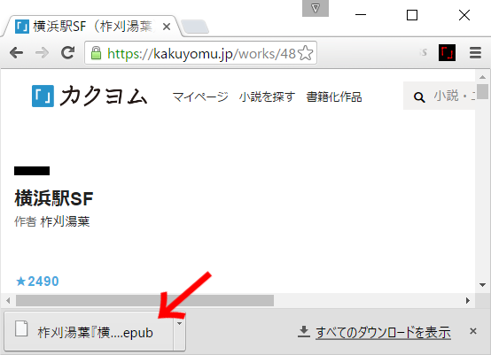

# exkakuyomu: カクヨム非公式拡張 for Google Chrome (ダウンロード/バックアップ/epub変換)

## 概要

　カクヨムの作品を電子書籍形式(epub形式)に変換するGoogle Chrome拡張です。
変換した電子書籍ファイルは、epubビューアを使えば、縦書き、ページ送り操作で閲覧できるようになります。また、エピソードの途中で読むのを中断しても、次回はそこから読書を再開でき、ひとつのエピソードが長い作品でも読みやすくなります。

　また、作品データをプレーンテキストで一括ダウンロードすることができるので、作品データのバックアップ用途にも使えます。

　この拡張は、完結済みの長編作品を一気読みしたいときに適しています。短編作品では横書きやスクロールで読んでも疲労はそれほどでもないですし、連載中の作品では更新があるごとに電子書籍ファイルを再生成する必要が生じるので手間がかかります。

## 使い方

### 拡張機能のインストール(使う前に一度だけ実行します)

1. githubからパッケージをダウンロードします。プロジェクトページ( https://github.com/Inarinokami/exkakuyomu )の右上にある緑色のボタン"Clone or download"を押して"Download ZIP"を選択するのが最も簡単です。
2. 1でダウンロードした"exkakuyomu-master.zip"を適当なフォルダに展開します。
3. Chromeのメニューから『拡張機能』を開き、その上部の『デベロッパーモード』にチェックを入れます。そうすると開発者用の追加のオプションが表示されます。
4. 『パッケージ化されていない拡張機能を読み込む』というボタンをクリックします。
5. ファイルの選択ダイアログが出るので、このReadmeがあるフォルダを選択します。
6. 拡張機能の一覧に『カクヨム非公式拡張』が追加されればインストール成功です。

### 電子書籍形式(epub形式)への作品の変換(読みたい作品それぞれについて、以下の手順を繰り返します)

5. カクヨムの各作品ページに行くと、ブラウザ右上の拡張機能のアイコンがアクティブになります。そのアイコンをクリックします。
6. 拡張機能のポップアップメニューから、『epub形式で取得』ボタンをクリックすると、作品のダウンロードと変換が開始されます。
7. epub変換が完了すると、ブラウザのダウンロードフォルダに『作品名.epub』という電子書籍ファイルが自動的にダウンロードされます。

### 電子書籍ファイルの閲覧をする方法の一例(Google Playブックスへの追加)

8. Google Play Booksの『マイブックス』( https://play.google.com/books )に行き、右上の『ファイルをアップロード』ボタンを押します。
9. ファイルの選択ダイアログが出るので、ここに『作品名.epub』というファイルをドラッグアンドドロップします。アップロードが完了すると、一覧に書籍が追加されます(PC版ブラウザ上のビューアでは正常に表示できないようです。調査中)。
10. 携帯端末側でPlayブックスアプリケーションを起動し、右上のメニューから『更新』を選択します。パソコンのブラウザ側でアップロードした電子書籍ファイルが表示されるはずです。

### 拡張機能のアンインストール

11. 拡張機能の一覧から、右上のゴミバケツのアイコンをクリックします。
12. 確認ダイアログが出るので削除を了承します。

## バックアップツールとしての使用

1. 各作品のページに行き、アイコンがアクティブになったらクリックします。ポップアップダイアログが表示されます。
2. 『プレーンテキスト形式で取得』ボタンをクリックします。ダウンロードが完了すると、『作品名.zip』という圧縮ファイルがブラウザによってダウンロードされます。

## 注意事項

* サーバへの高頻度なアクセスを避けるために、ダウンロードの速度は遅めにしてあります。気長にお待ちください
* ログイン状態のブラウザで使用した場合、ダウンロードしようとするすべてのエピソードに自分の閲覧履歴が残ります。
* 最後に読んだエピソードのマークも移動します。
* 『ページビュー』チェックボックスにチェックを入れた状態でダウンロードを行うと、各エピソードにページビューがつきます。チェックを外した場合はページビューがつきません。
* バックアップをするとき、ルビの構文に必ず垂直バーがついた形式になります(仕様)。
* 半角英数字は横に倒れたままになります(仕様)。
* 作成した電子書籍ファイルは私的な使用のみに限ってください。自分の作品を変換したものでない限り、それを無断で第三者に配布することは作者の権利を侵害するおそれがあります。

## 生成されたepubファイルのビューア別対応状況

* Readium ……　◎
* Google Play ブックス(Android) ……　○（縦中横が正しく表示されない）
* Kindle ……　○（縦中横が正しく表示されない。mobi形式に変換する必要あり）
* Kindle Previewer ……　△（mobi形式への変換は正常に完了するが、プレビューは崩れる）
* FBReader(Android)　……　△（横書きで表示される）
* Google Play ブックス(デスクトップ) ……　×
* Calibre …… ×
* EPUBReader(Firefox)　……　×
